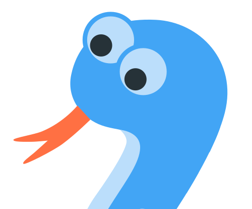

<h1 align="center">
  <br>
    
  <br><br>
  Snake
  <br>
  <br>
</h1>

<h4 align="center">First class Snake game. Powered by Svelte.</h4>

## Game instructions

By either pressing one of the arrow keys on the keyboard or by using swipe gestures on a mobile device the Snake is starting to move. In the same way, the direction of the snake can be changed while it is moving. Since the snake is hungry, it would like to eat as many apples as possible. Each apple eaten makes the snake a little bigger, which also restricts the freedom of movement. The goal is to swallow as many apples as possible.

## Technological background

This game was implemented with the frontend framework [Svelte](https://svelte.dev/). The code base is written with TypeScript and Webpack is used for bundling into executable JavaScript code in the browser. For the rendering of the game logic a Canvas element is used.

### Installation instructions

To get the game up and running on a local machine it's necessary to install the runtime [Node.js](https://nodejs.org/en/).

#### Install dependencies

```
npm install
```

#### Start local development server

```
npm start
```

#### Generate production bundle

```
npm run build
```
